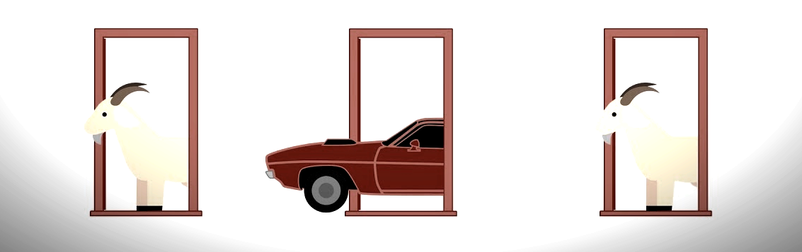

# Monty Hall



In 1963 the [Let's Make a Deal] television game-show, hosted by Monty Hall, made its first appearance on the US. The show consisted of selecting a random guest from the audience to make a deal with the host. One of the most popular deals in the show became famous as a brain-teaser when published in the [Parade magazine] in 1990:

> Suppose you're on a game show, and you're given the choice of three doors: Behind one door is a car; behind the others, goats. You pick a door, say No. 1, and the host, who knows what's behind the doors, opens another door, say No. 3, which has a goat. He then says to you, "Do you want to pick door No. 2?" Is it to your advantage to switch your choice? 

[Let's Make a Deal]: https://en.wikipedia.org/wiki/Let%27s_Make_a_Deal
[Parade magazine]: https://en.wikipedia.org/wiki/Parade_(magazine)

This repository contains a simple simulation of the game-show by using object-oriented programming in python. 

## Usage

There are two main options: 

* `play_single_game`: Plays a single monty-hall show game and prints out the game development. 
* `play_muliple_games`: Plays multiple games and calculates the results statistics. 

### Single Game

The single-game command runs as following: 

```commandline
$ python main.py play_single_game --strategy random --opts 3 
```

Options: 

```text
    --strategy  : The strategy used by the guest.
                  * Values: random, stay, change
                  * Default: random
    --opts      : The number of initial options (doors) in the game. 
                  * Default: 3 
```

The guest's strategy defines which door the guest is going to select after the host reveals an option: 

* `random`: The guest will always select a random option from the available ones regardless of the initial choice. 
* `stay`: The guest will always remain with the first option. Previous choices are stored in the guest's memory attribute.
* `change`: The gusts will always change randomly to a different door than the initial one. 

Note that the latest choice is needed for the `stay` and `change` strategies. This value is stored in the guest's memory attribute and can be retrieved with the `get_latest_choice` method. 

Examples: 

```commandline
$ python main.py play_single_game --strategy random --opts 3 
Game Configuration:
        0 -> Door(car)
        1 -> Door(goat)
        2 -> Door(goat)
(t=1) Guest's first choice: 0
(t=2) Host reveals door with a goat: 2
(t=3) Guest's final choice: 1
(t=4) Game result Door(goat)
```

```commandline
$ python main.py play_single_game --strategy stay --opts 5 
Game Configuration:
        0 -> Door(goat)
        1 -> Door(car)
        2 -> Door(goat)
        3 -> Door(goat)
        4 -> Door(goat)
(t=1) Guest's first choice: 3
(t=2) Host reveals door with a goat: 2
(t=3) Guest's final choice: 3
(t=4) Game result Door(goat)
```

```commandline
$ python main.py play_single_game --strategy change --opts 3 
Game Configuration:
        0 -> Door(car)
        1 -> Door(goat)
        2 -> Door(goat)
(t=1) Guest's first choice: 2
(t=2) Host reveals door with a goat: 1
(t=3) Guest's final choice: 0
(t=4) Game result Door(car)
```


### Multiple Games

The multiple game command runs as following: 

```commandline
$ python main.py play_multiple_games --strategy change --times 1000 --opts 3 --save file.csv
```

Options: 

```text
    --strategy  : The strategy used by the guest.
                  * Values: random, stay, change
                  * Default: random
    --times     : Number of times to run the simulation.
                  * Default: 100
    --opts      : The number of initial options (doors) in the game. 
                  * Default: 3 
    --save      : Save the statistics into a csv file. Ignore if empty string. 
                  * Default: ""
```

Examples: 

```commandline
$ python main.py play_multiple_games --strategy random --times 10000 --opts 3 --save file.csv
  game-result  count
0         car   5009
1        goat   4991

```

```commandline
$ python main.py play_multiple_games --strategy stay --times 10000 --opts 3 --save file.csv  
  game-result  count
0         car   3347
1        goat   6653
```

```commandline
$ python main.py play_multiple_games --strategy change --times 10000 --opts 3 --save file.csv
  game-result  count
0         car   6696
1        goat   3304
```
